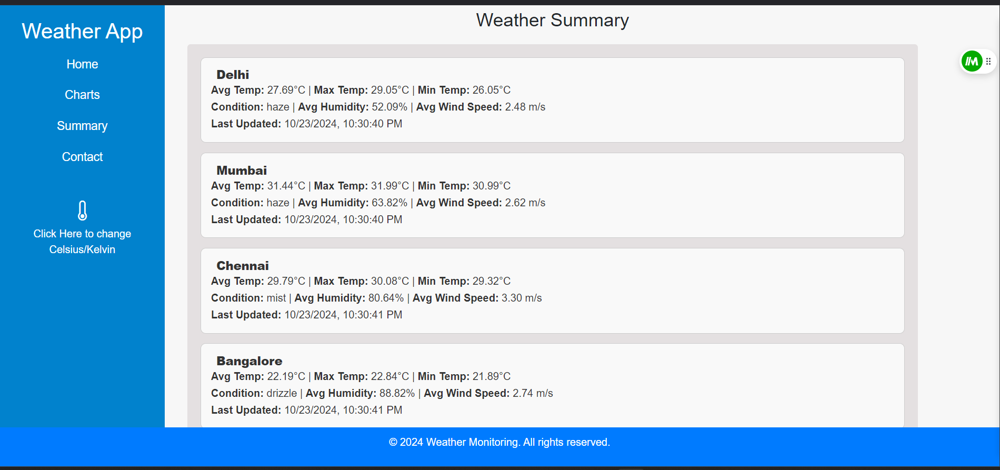

# Weather Monitoring System

A real-time weather monitoring system that retrieves and displays weather data using the OpenWeatherMap API. This project allows users to view temperature, humidity, wind speed, and cloud cover for specified locations, visually represented through interactive charts.

## Table of Contents
- [Features](#features)
- [System Requirements](#system-requirements)
- [Installation](#installation)
- [Configuration](#configuration)
- [Running the Application](#running-the-application)
- [Testing](#testing)
- [Usage](#usage)


## Features
- Real-time weather data retrieval from the OpenWeatherMap API.
- Data processing for temperature, humidity, wind speed, and cloud cover.
- Conversion of temperature values between Kelvin, Celsius, and Fahrenheit.
- Daily weather summaries, including average, maximum, and minimum temperatures.
- Visual representation of weather data using charts.

## System Requirements
- Java 21 (OpenJDK)
- Maven 3.8 or higher
- A valid OpenWeatherMap API key
- Database (e.g., MySQL or another relational database)

## Installation
1. **Clone the Repository:**
   ```bash
   git clone https://github.com/dipakja/RuleEngine.git
   cd RuleEngine
2.Install Dependencies: Ensure you have Maven installed. Then, run the following command in the project directory:

```bash
mvn install
```
## Configuration
1.Database Credentials: Open the src/main/resources/application.properties file and configure your database credentials:
```bash
spring.datasource.url=jdbc:mysql://localhost:3306/your_database_name
spring.datasource.username=your_database_username
spring.datasource.password=your_database_password
```
## Database Schema

### Weather Readings Table
You can create the `<sub>weather_readings</sub>` table using the following SQL query:

```sql
CREATE TABLE weather_readings (
    id BIGINT NOT NULL AUTO_INCREMENT PRIMARY KEY,
    temperature DOUBLE NOT NULL,
    weather_condition VARCHAR(255) NOT NULL,
    humidity DOUBLE NOT NULL,
    wind_speed DOUBLE NOT NULL,
    cloud_cover INT NOT NULL,
    timestamp DATETIME NOT NULL,
    city VARCHAR(255) NOT NULL
);
```

### Weather Summary Table
You can create the `<sub>weather_summary</sub>` table using the following SQL query:
```sql
CREATE TABLE weather_summary (
    id BIGINT NOT NULL AUTO_INCREMENT PRIMARY KEY,
    city VARCHAR(255) NOT NULL,
    average_temperature DOUBLE NOT NULL,
    maximum_temperature DOUBLE NOT NULL,
    minimum_temperature DOUBLE NOT NULL,
    dominant_weather_condition VARCHAR(255) NOT NULL,
    average_humidity DOUBLE NOT NULL DEFAULT 0,
    average_wind_speed DOUBLE NOT NULL DEFAULT 0,
    last_updated TIMESTAMP DEFAULT CURRENT_TIMESTAMP ON UPDATE CURRENT_TIMESTAMP,
    date TIMESTAMP DEFAULT CURRENT_TIMESTAMP
);
```

2.OpenWeatherMap API Key: Add your OpenWeatherMap API key to the application.properties file:
```bash
openweathermap.api.key=your_api_key
```
## Running the Application
To run the application, use the following command in the project directory:
```bash
mvn spring-boot:run
```
Once the application is running, you can access it at:

```bash
http://localhost:8080
```
## Testing
 Test Cases:
1.System Setup:
Verify that the system starts successfully and connects to the OpenWeatherMap API using a valid API key.

2.Data Retrieval:
Simulate API calls at configurable intervals.
Ensure the system retrieves weather data for the specified location and parses the response correctly.

3.Temperature Conversion:
Test the conversion of temperature values from Kelvin to Celsius (or Fahrenheit) based on user preference.

4.Daily Weather Summary:
Simulate a sequence of weather updates for several days.
Verify that daily summaries are calculated correctly, including average, maximum, minimum temperatures, and the dominant weather condition.


## Usage
After accessing the application in your browser, you will see the weather dashboard. You can select the cities you want to monitor, and the application will display real-time weather data along with visually represented charts showing temperature, humidity, wind speed, and cloud cover trends.

## Bonus Features
i.Visual Representation of Data: The application includes interactive charts that provide a visual summary of the weather data, making it easier to understand trends over time.

ii.Alerts for Extreme Weather: Users can set thresholds for temperature or weather conditions, receiving alerts when those thresholds are crossed.


## Screenshots





## Conclusion
The Weather Monitoring System provides a comprehensive solution for tracking weather data in real-time.
Through continuous updates and visual representation, users can gain insights into weather patterns, making it a valuable tool for both personal and professional use.
